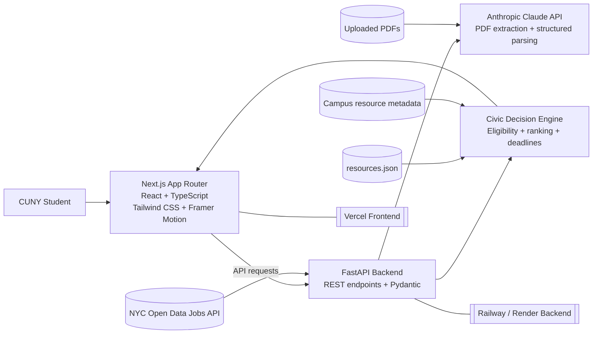
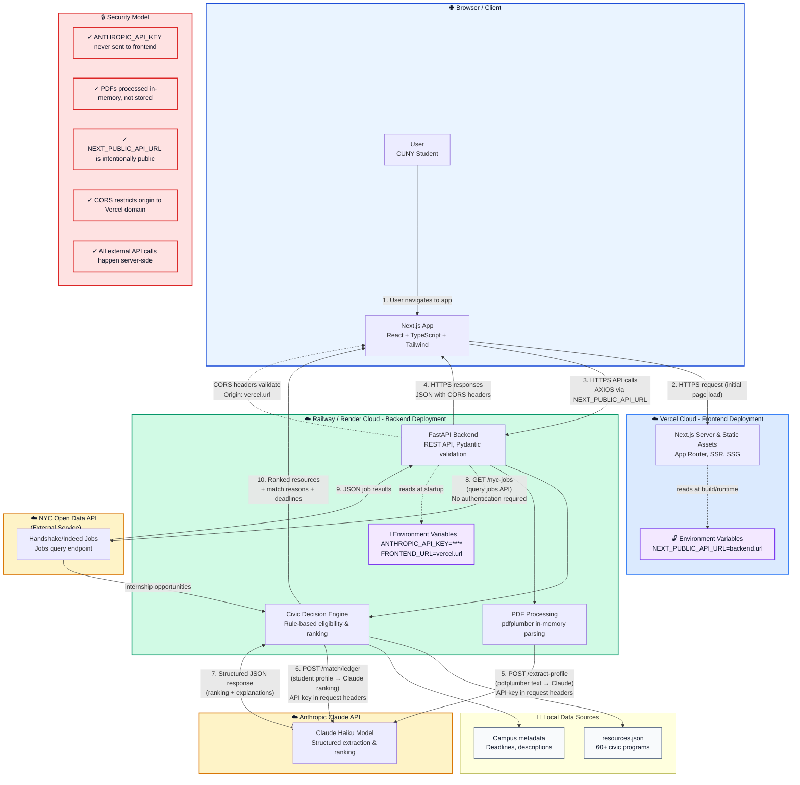

# BridgeAI

### Explainable Civic Resource Intelligence for CUNY Students

[](#)
[](#)
[](#)
[](#)
[](https://github.com/musaddikchoudhury/cuny-ai-innovation-challenge-alfatech/actions/workflows/ci.yml)

> AI suggests. The civic decision engine verifies.

BridgeAI helps CUNY students discover scholarships, public benefits, food support, internships, and campus resources through a hybrid AI + deterministic rules architecture. AI handles extraction and explanation; auditable rules handle eligibility, ranking constraints, deadlines, and trust-critical decisions.

The goal is simple: reduce the paperwork burden for students without turning civic eligibility into a black box.

---

## Executive Summary

New York City students often miss support they qualify for because program requirements are scattered across PDFs, campus pages, agency portals, and job boards. BridgeAI turns a student profile into a ranked civic resource ledger with clear next steps, deadlines, estimated value, and plain-language match reasons.

BridgeAI is designed as a public-interest AI system rather than a generic chatbot:

- **AI-assisted intake** extracts structured profile data from documents, resumes, and form input.
- **Rule-based eligibility** verifies scholarship, benefit, internship, and campus resource matches.
- **Explainable ranking** shows why each opportunity appears and what makes it urgent or valuable.
- **Privacy-aware deployment** keeps API keys server-side and processes uploads in memory.
- **Reviewer-friendly demo mode** keeps the experience usable even when live AI services are unavailable.

---

## System Highlights

| Area | Implementation |
| --- | --- |
| Frontend | Next.js App Router, React, TypeScript, Tailwind CSS, Framer Motion |
| Backend | FastAPI, Pydantic, pdfplumber, Anthropic Claude API |
| Decision layer | Deterministic eligibility rules over `resources.json` |
| AI layer | Structured extraction, profile parsing, explanation generation |
| Data sources | Curated civic resources plus NYC Open Data jobs integration |
| Deployment | Vercel frontend, Railway/Render FastAPI backend, Docker Compose support |
| Integration safety | TypeScript API contracts and typed fetch helpers in `lib/types.ts` and `lib/api.ts` |

---

## Features

- Multi-path onboarding through PDF upload, resume upload, LinkedIn-style profile entry, or quick form
- Civic Decision Engine for scholarships, public benefits, internships, food support, and campus resources
- Ranked opportunity ledger with fit scores, estimated values, match reasons, and deadlines
- Deadline tracker with reminder and Google Calendar actions
- BridgeBot advisor for both general and profile-aware civic resource guidance
- Resume curation support for internship matches
- Demo profile mode for reviewers and offline presentation flows
- Typed frontend API helpers for safer client/backend integration

---

## Architecture

BridgeAI separates suggestion from verification. The AI layer converts messy inputs into structured data and helps generate explanations. The decision engine applies auditable rules from the resource ledger before any recommendation is presented to the student.

### Repository Map

```text
app/                  Next.js routes and global styles
components/           Shared UI components and BridgeBot widget
lib/                  Frontend API contracts and typed fetch helpers
main.py               FastAPI backend and civic decision engine
resources.json        Curated resource eligibility dataset
docs/                 Technical audit and supporting documentation
public/               Static assets
```

### High-Level System



PDF versions:

- [Onboarding and Matching Flow PDF](docs/bridgeai-onboarding-matching-sequence.pdf)
- [Presentation Architecture PDF](docs/bridgeai-presentation-architecture.pdf)

### Why This Architecture

- **Fairness:** Eligibility is based on explicit, inspectable thresholds rather than writing style or demographic proxies.
- **Reliability:** Claude does not decide whether a student qualifies; deterministic rules remain the source of truth.
- **Trust:** Students see concrete reasons such as GPA, income range, enrollment status, major alignment, and deadline urgency.
- **Maintainability:** Program updates can be made in `resources.json` without retraining a model.
- **Cost control:** AI is reserved for high-leverage extraction and explanation tasks rather than every rule evaluation.

### System Architecture Deep Dive

BridgeAI follows a hybrid AI + deterministic rules pattern:

- **AI Layer:** Claude API handles document extraction, profile structuring, and explanation generation. API keys remain server-side.
- **Rules Layer:** FastAPI enforces deterministic eligibility logic with clear thresholds such as GPA, credits, income, citizenship, enrollment, major, and skills.
- **Ranking Layer:** Fit scores combine rule satisfaction, urgency, estimated value, and alignment signals.
- **Data Layer:** `resources.json` is the source of truth for 60+ civic programs. NYC Open Data provides live internship opportunities.

Public-interest tech has a higher explainability bar than consumer recommendation systems. BridgeAI keeps the model useful while keeping the decision path auditable.

---

## AI Decision Pipeline

The pipeline moves from student-provided data to validated profile fields, then to verified eligibility and ranked recommendations.

### Workflow Diagram

```mermaid
flowchart TD
  %% Student Input Layer
  INPUT["🎓 Student Input"]
  PDF["📄 PDF Upload\nTranscript, FAFSA, Award Letter"]
  RESUME["📋 Resume Upload\nWork & Skills"]
  FORM["📝 Manual Form\nGPA, Credits, Income"]
  LINKEDIN["🔗 LinkedIn Profile\nEducation, Skills, Experience"]
  
  INPUT --> PDF
  INPUT --> RESUME
  INPUT --> FORM
  INPUT --> LINKEDIN
  
  %% Data Extraction Layer - AI POWERED
  subgraph EXTRACT["🤖 AI Data Extraction Layer"]
    direction LR
    PDFPARSE["pdfplumber\nText Extraction"]
    CLAUDE["Anthropic Claude API\nStructured Parsing"]
    JSON["Structured JSON\nStudent Profile"]
    
    PDFPARSE --> CLAUDE --> JSON
  end
  
  PDF --> PDFPARSE
  RESUME --> PDFPARSE
  FORM --> CLAUDE
  LINKEDIN --> CLAUDE
  
  %% Validation Layer
  subgraph VALIDATE["✅ Validation Layer"]
    direction LR
    PYDANTIC["Pydantic Schema\nValidation"]
    NORM["Data Normalization\nField Standardization"]
    DEFAULTS["Missing Fields\nDefault Handling"]
    PROFILE["Validated Profile\nStudent.gpa, .credits, .income, .major"]
    
    PYDANTIC --> NORM --> DEFAULTS --> PROFILE
  end
  
  JSON --> PYDANTIC
  
  %% Decision Engine - DETERMINISTIC RULES
  subgraph DECIDE["⚙️ Civic Decision Engine (Rule-Based)"]
    direction TB
    
    LOAD["Load resources.json\n60+ civic programs"]
    ELIGIBILITY["Rule-Based Eligibility\nmin_gpa, min_credits, income_limit, citizenship"]
    SCHOLARSHIP["Scholarship Filtering\nGPA ≥ 2.0, Citizenship Required"]
    BENEFITS["Benefit Qualification\nSNAP: income &lt; $19k\nFair Fares: income &lt; $14.5k"]
    INTERNSHIP["Internship Filtering\nCredits, Major, Skills Match"]
    DEADLINE["Deadline Prioritization\nRolling vs Fixed Deadlines"]
    
    LOAD --> ELIGIBILITY
    ELIGIBILITY --> SCHOLARSHIP
    ELIGIBILITY --> BENEFITS
    ELIGIBILITY --> INTERNSHIP
    SCHOLARSHIP --> DEADLINE
    BENEFITS --> DEADLINE
    INTERNSHIP --> DEADLINE
  end
  
  PROFILE --> LOAD
  
  %% Ranking Layer
  subgraph RANK["📊 Ranking &amp; Explainability Layer"]
    direction LR
    FITSCORE["Fit Score Algorithm\n50-100 scale"]
    VALUE["Estimated Value\nFinancial Impact"]
    URGENCY["Urgency Scoring\nDays Until Deadline"]
    EXPLAIN["Explainability Engine\nGenerate Match Reasons"]
    RANKED["Ranked Opportunities\nSorted by Fit Score"]
    
    FITSCORE --> VALUE
    VALUE --> URGENCY
    URGENCY --> EXPLAIN
    EXPLAIN --> RANKED
  end
  
  DEADLINE --> FITSCORE
  
  %% User Results Layer
  subgraph RESULTS["📱 User Results &amp; Dashboard"]
    direction TB
    DASHBOARD["Decision Ledger\nRanked Opportunities"]
    EXPLANATIONS["Match Explanations\n'Your full-time enrollment\nand GPA make you eligible'"]
    DEADLINES["Deadline Alerts\nUrgent, Upcoming, Rolling"]
    ACTIONS["Next Steps\nApply, Save, Learn More"]
    REMINDS["Google Calendar\nEmail Reminders"]
    
    DASHBOARD --> EXPLANATIONS
    EXPLANATIONS --> DEADLINES
    DEADLINES --> ACTIONS
    ACTIONS --> REMINDS
  end
  
  RANKED --> DASHBOARD
  
  %% Styling
  classDef input fill:#EAF4FF,stroke:#1D4ED8,color:#0F172A,stroke-width:1.2px;
  classDef ai fill:#DBEAFE,stroke:#3B82F6,color:#0F172A,stroke-width:2px;
  classDef validate fill:#F8FAFC,stroke:#64748B,color:#0F172A,stroke-width:1.2px;
  classDef rules fill:#D1FAE5,stroke:#059669,color:#0F172A,stroke-width:2px;
  classDef rank fill:#FEF3C7,stroke:#D97706,color:#0F172A,stroke-width:1.2px;
  classDef results fill:#F0F9FF,stroke:#0284C7,color:#0F172A,stroke-width:1.2px;
  classDef flow fill:#FFFFFF,stroke:#94A3B8,color:#0F172A,stroke-dasharray: 4 3;
  
  class INPUT,PDF,RESUME,FORM,LINKEDIN input;
  class EXTRACT,PDFPARSE,CLAUDE,JSON ai;
  class VALIDATE,PYDANTIC,NORM,DEFAULTS,PROFILE validate;
  class DECIDE,LOAD,ELIGIBILITY,SCHOLARSHIP,BENEFITS,INTERNSHIP,DEADLINE rules;
  class RANK,FITSCORE,VALUE,URGENCY,EXPLAIN,RANKED rank;
  class RESULTS,DASHBOARD,EXPLANATIONS,DEADLINES,ACTIONS,REMINDS results;
```



### Intake

Students can provide data through:

- **PDF upload:** transcripts, FAFSA forms, financial aid letters, and benefit documents
- **Resume upload:** skills, work history, projects, and internship signals
- **Manual form:** GPA, credits, income, major, borough, enrollment status, first-generation status, and dependents
- **LinkedIn-style profile:** structured education and experience input

### Extraction and Validation

Claude receives unstructured text and returns a structured `StudentProfile` payload:

```json
{
  "gpa": 3.4,
  "credits_completed": 75,
  "annual_income": 22000,
  "major": "Computer Science",
  "citizenship": "US Citizen",
  "enrollment": "full-time",
  "borough": "Manhattan",
  "is_first_gen": true,
  "has_dependents": false,
  "skills": ["Python", "React", "SQL"]
}
```

Pydantic validates the schema before the profile reaches the decision engine.

### Eligibility

For each resource in `resources.json`, the engine:

1. Applies min/max thresholds for GPA, credits, income, citizenship, enrollment, and related fields.
2. Categorizes results into scholarships, benefits, internships, food support, and campus resources.
3. Prioritizes deadlines and marks rolling, upcoming, or urgent opportunities.

Example rule shape:

```python
# Scholarships require GPA >= 2.0 and US citizenship
if student.gpa >= 2.0 and student.citizenship == "US Citizen":
    eligible_for_scholarships.append(resource)

# SNAP benefits require annual income < $19k
if student.annual_income < 19000:
    eligible_for_benefits.append(resource)
```

### Ranking and Explainability

Eligible resources are returned with fit scores, estimated value, deadlines, and explanations:

```json
{
  "resource_id": "nyc-scholarship-2024",
  "name": "NYC Excellence Scholarship",
  "fit_score": 87,
  "match_reason": "Your full-time enrollment, 3.4 GPA, and first-generation status make you a strong candidate.",
  "estimated_value": 5000,
  "deadline": "2024-06-30"
}
```

Fit score calculation:

- Base 50 points for resources that pass eligibility checks
- +20 for deadline urgency within 30 days
- +15 for major or program alignment
- +5 for relevant skills or profile signals

---

## Explainability and Trust

BridgeAI treats explanations as part of the product surface, not an afterthought. Students should understand both what they qualify for and why.

Core trust mechanisms:

- **Clear rules:** Decisions come from inspectable thresholds such as income, GPA, credits, and enrollment.
- **Plain-language reasons:** Every result includes a short match explanation.
- **Deadline transparency:** Results distinguish urgent, upcoming, and rolling opportunities.
- **Auditable data:** `resources.json` is human-readable and can be reviewed by maintainers.
- **No success-proxy scoring:** The system avoids opaque predictions like "likelihood to succeed."

Example score breakdown:

```text
Scholarship Fit Score: 87 / 100

Eligibility: base 50 points
- GPA 3.4 >= 2.0
- US Citizen
- Full-time enrollment

Alignment: +20 points
- First-generation student signal
- Deadline within 30 days

Skills match: +10 points
- Computer Science major aligns with program focus
```

---

## Deployment

BridgeAI is designed for a split deployment model: the frontend is hosted on Vercel, and the FastAPI backend runs on a Python host such as Railway or Render.

### Cloud Deployment Architecture



### Deployment Notes

- Deploy the FastAPI backend first on Railway, Render, or another Python host.
- Confirm `/health` is online before connecting the frontend.
- Set `NEXT_PUBLIC_API_URL` in Vercel to the deployed backend URL.
- Set `FRONTEND_URL` on the backend host to the deployed Vercel domain for CORS.
- Use the repo root as the Vercel project root. Vercel should auto-detect Next.js and run `npm run build`.
- No `vercel.json` is required for the current frontend setup.

### Docker

The repository includes a two-service Docker setup:

- `Dockerfile.api` builds the FastAPI backend.
- `Dockerfile.web` builds the Next.js frontend.
- `docker-compose.yml` starts both services together.

Run the full stack locally:

```bash
docker compose up --build
```

This exposes:

- Frontend: `http://localhost:3000`
- Backend: `http://localhost:8000`

Set `ANTHROPIC_API_KEY` in your shell before starting Compose if you want AI-powered endpoints to be live.

---

## Security and Privacy

BridgeAI handles sensitive student profile fields, including GPA, income, citizenship, and enrollment status. The current implementation is intentionally lightweight, but the privacy model is explicit.

### Data Handling

| Data Type | Storage | Retention | Notes |
| --- | --- | --- | --- |
| Uploaded PDFs | In memory only | Not persisted | Deleted after extraction |
| Student profiles | Browser `localStorage` | Until logout/clear | `bridge_profile` key |
| Match results | Browser `localStorage` | Until logout/clear | `bridge_matches` key |
| Saved resources | Browser `localStorage` | Persistent | User can delete manually |
| API logs | Backend logs | Operational only | Should not include raw PII |
| Anthropic API calls | Anthropic systems | Per provider policy | Used for extraction/explanation |

### API Key and Network Boundaries

- `ANTHROPIC_API_KEY` is stored only on the backend host.
- `NEXT_PUBLIC_API_URL` is intentionally public because browser code must know where to send API requests.
- PDF parsing and Claude calls happen server-side.
- CORS should restrict production requests to the deployed frontend origin.
- HTTPS should be used for all production traffic.
- `.env` and secret files should never be committed.

### PII Handling

- Student profile data is validated server-side before matching.
- No PII is sent to NYC Open Data when querying internship listings.
- Anthropic calls are used only for extraction and explanation tasks.
- Students can clear local profile and match data from the browser.

### Compliance Notes

- **FERPA:** Assumes student profile data is student-provided, not pulled from institutional systems.
- **GDPR:** A future account-based version should include export and deletion workflows.
- **CCPA:** A future persistent profile system should provide data access and deletion endpoints.

---

## API Reference

The backend exposes REST endpoints through FastAPI. The live OpenAPI schema is available at `/docs` when the API server is running.

### `POST /extract-profile`

Extract a structured student profile from an uploaded document.

```bash
curl -X POST http://localhost:8000/extract-profile \
  -F "file=@transcript.pdf"
```

Response:

```json
{
  "gpa": 3.4,
  "credits_completed": 75,
  "annual_income": 22000,
  "major": "Computer Science",
  "citizenship": "US Citizen",
  "enrollment": "full-time",
  "borough": "Manhattan",
  "is_first_gen": true,
  "has_dependents": false
}
```

### `POST /match/ledger`

Match a validated student profile against the civic resource ledger.

Request:

```json
{
  "gpa": 3.4,
  "credits_completed": 75,
  "annual_income": 22000,
  "major": "Computer Science",
  "citizenship": "US Citizen",
  "enrollment": "full-time",
  "borough": "Manhattan",
  "is_first_gen": true,
  "has_dependents": false
}
```

Response:

```json
{
  "matched_resources": [
    {
      "id": "scholarship-001",
      "name": "NYC Excellence Scholarship",
      "category": "Scholarship",
      "value": 5000,
      "fit_score": 87,
      "match_reason": "Your full-time enrollment and 3.4 GPA make you eligible.",
      "deadline": "2024-06-30"
    }
  ],
  "access_score": 42,
  "unclaimed_value": 45000,
  "warnings": ["SNAP eligibility expires in 30 days"]
}
```

### Additional Endpoints

| Endpoint | Purpose |
| --- | --- |
| `POST /chat/landing-bot` | Public chatbot for general civic-tech questions without profile context |
| `POST /chat/bridge-bot` | Profile-aware resource advisor using student context |
| `GET /nyc-jobs` | Query live internship opportunities from NYC Open Data |
| `POST /tailor-resume` | Generate resume suggestions for a specific internship opportunity |
| `GET /health` | Service health check for local development and deployment pipelines |

### Rate Limits and Quotas

- `POST /extract-profile`: 5 requests per minute per IP
- Claude API calls: batch and cache where possible to manage cost
- NYC Open Data jobs: 10 requests per minute

---

## Local Development

### Quick Start

Install frontend dependencies:

```bash
npm install
```

Create a Python environment and install backend dependencies:

```bash
python3 -m venv .venv
source .venv/bin/activate
pip install -r requirements.txt
```

Start the FastAPI backend:

```bash
python3 -m uvicorn main:app --reload --host 0.0.0.0 --port 8000
```

Start the Next.js frontend:

```bash
npm run dev
```

Open `http://localhost:3000`.

### Environment Variables

Frontend:

```bash
NEXT_PUBLIC_API_URL=http://127.0.0.1:8000
```

Backend:

```bash
ANTHROPIC_API_KEY=your_anthropic_api_key
FRONTEND_URL=http://localhost:3000
```

For production, set `FRONTEND_URL` to the deployed Vercel URL. Multiple origins can be comma-separated.

### VS Code Tasks

The workspace includes tasks for common development flows:

- `dev:api` starts the FastAPI server.
- `dev:web` starts the Next.js app.
- `dev:all` starts both in parallel.

### Verification

```bash
npm run lint
npm run build
python3 -m py_compile main.py
curl http://127.0.0.1:8000/health
```

---

## Engineering Decisions

### Why Next.js App Router and React?

- Strong support for server-rendered and static routes.
- Smooth Vercel deployment path with automatic HTTPS.
- TypeScript improves safety around profile, resource, and API response contracts.
- Tailwind supports responsive UI patterns for students using mobile devices.

### Why FastAPI?

- Async I/O works well for PDF processing, external APIs, and AI provider calls.
- Pydantic models validate student profiles and resource metadata.
- The generated OpenAPI docs make the backend easier to inspect.
- The current single-file backend is hackathon-friendly while still allowing later service extraction.

### Why Claude Haiku?

- Lower cost and latency for structured extraction workloads.
- Reliable enough for profile parsing and short explanation generation.
- JSON-oriented outputs reduce brittle post-processing.

### Why Hybrid AI + Rules?

- Civic eligibility decisions should be explainable and auditable.
- Rules can be reviewed, tested, and updated without model retraining.
- AI is useful for messy input extraction, but not trusted as the final eligibility authority.

---

## Accessibility

BridgeAI is built for students who may be using phones, assistive technology, or low-friction demo access.

- Responsive UI for mobile-first usage.
- Semantic HTML and ARIA-aware components for dashboard and table surfaces.
- Plain-language errors and explanations.
- Multiple input methods for different comfort levels and document availability.
- Demo mode without login for reviewers and first-time users.
- Planned multilingual support for Spanish, Mandarin, Korean, and other NYC language communities.

---

## Known Limitations

| Limitation | Current Workaround | Planned Direction |
| --- | --- | --- |
| CUNY-first scope | Focus on NYC/CUNY resource rules | Generalize rule engine for other institutions |
| Manual resource curation | Update `resources.json` by hand | Admin workflow or structured sync from trusted sources |
| No OCR for scanned PDFs | Use manual form input | Add Tesseract, Azure Vision, or multimodal extraction |
| No persistent accounts | Browser `localStorage` demo mode | Add Supabase/Auth0 and PostgreSQL |
| Rough value estimates | Use program value ranges | Partner with financial aid and benefits experts |
| Self-reported profile data | Trust student-provided fields | Add optional verification integrations later |

---

## Roadmap

### Phase 1: MVP Refinement

- [ ] Add OCR for scanned PDFs
- [ ] Expand resource database to 100+ programs
- [ ] Deploy production frontend and backend URLs
- [ ] Add end-to-end tests for decision engine flows
- [ ] Add richer CUNY campus metadata, office hours, and resource locations

### Phase 2: Multi-Institution Support

- [ ] Support additional CUNY campuses and program variants
- [ ] Generalize rule definitions for non-CUNY institutions
- [ ] Build admin tooling for resource curation
- [ ] Add authentication and persistent student profiles
- [ ] Track saved resources and application history across sessions

### Phase 3: Evaluation and Intelligence Layer

- [ ] Track which recommendations students save or apply to
- [ ] Improve extraction prompts through evaluation sets
- [ ] Add outcome tracking for scholarships, benefits, and internships
- [ ] Introduce recommendation quality metrics without replacing rule verification

### Phase 4: Scale and Impact

- [ ] Expand to national civic resources and federal programs
- [ ] Add React Native or Flutter mobile app
- [ ] Add multilingual support
- [ ] Integrate with institutional financial aid systems where permitted
- [ ] Build analytics dashboards for equity and access teams

---

## Contributing

BridgeAI is a civic-tech codebase, so contributions should preserve transparency, explainability, and student privacy.

### Getting Started

1. Fork and clone the repository.
2. Follow the [Local Development](#local-development) setup.
3. Create a focused feature branch with a conventional name such as `feat/resource-admin` or `fix/pdf-extraction`.

### Code Standards

- Frontend: ESLint and Prettier through `npm run lint`
- Backend: Black formatting and type hints
- Commits: conventional commit prefixes such as `feat:`, `fix:`, `docs:`, and `refactor:`
- Tests: add focused coverage for decision engine rule changes and API contract changes

### Adding a Civic Resource

Add an entry to `resources.json`, then test it against both eligible and ineligible profiles:

```json
{
  "id": "resource-name",
  "name": "Program Name",
  "category": "Scholarship | Benefit | Internship | Campus",
  "description": "One-line description",
  "eligibility": {
    "min_gpa": 2.0,
    "min_credits": 0,
    "max_income": 50000,
    "citizenship_required": false
  },
  "value": 5000,
  "deadline": "2024-06-30",
  "link": "https://...",
  "contact": "contact@program.org"
}
```

### Modifying Decision Rules

- Treat rule changes as behavior changes.
- Document threshold sources and keep the rule explainable to non-engineers.
- Add tests showing both matching and non-matching profiles.

### Reporting Issues

- Use a specific title.
- Include reproduction steps and expected vs. actual behavior.
- Add an example student profile or document type when relevant.
- Include local/deployed environment details.

---

## Project Context

BridgeAI began as a CUNY AI Innovation Challenge project and has been refactored toward a production-aware open-source civic-tech platform. The current codebase preserves the original public-interest mission while improving integration safety, documentation quality, deployment clarity, accessibility, and reviewer experience.
