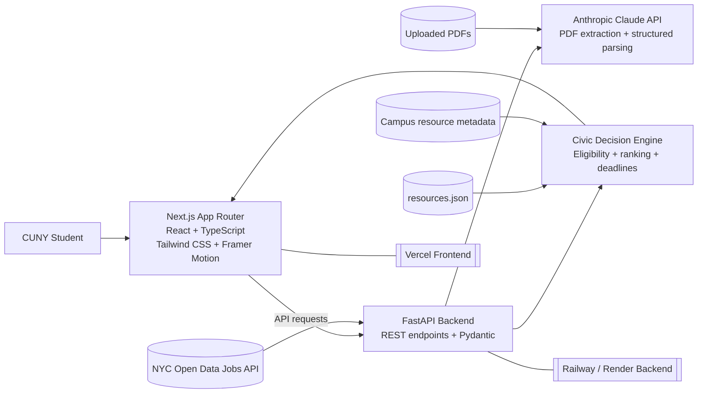
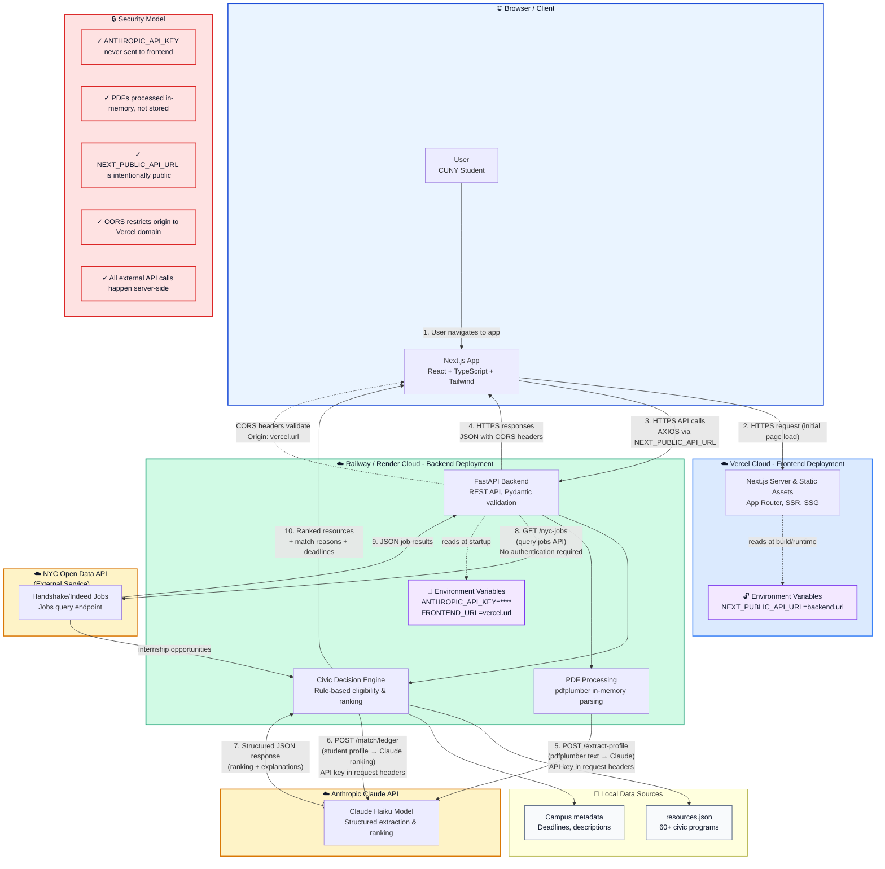

```mermaid
flowchart TD
  %% Student Input Layer
  INPUT["🎓 Student Input"]
  PDF["📄 PDF Upload\nTranscript, FAFSA, Award Letter"]
  RESUME["📋 Resume Upload\nWork & Skills"]
  FORM["📝 Manual Form\nGPA, Credits, Income"]
  LINKEDIN["🔗 LinkedIn Profile\nEducation, Skills, Experience"]
  
  INPUT --> PDF
  INPUT --> RESUME
  INPUT --> FORM
  INPUT --> LINKEDIN
  
  %% Data Extraction Layer - AI POWERED
  subgraph EXTRACT["🤖 AI Data Extraction Layer"]
    direction LR
    PDFPARSE["pdfplumber\nText Extraction"]
    CLAUDE["Anthropic Claude API\nStructured Parsing"]
    JSON["Structured JSON\nStudent Profile"]
    
    PDFPARSE --> CLAUDE --> JSON
  end
  
  PDF --> PDFPARSE
  RESUME --> PDFPARSE
  FORM --> CLAUDE
  LINKEDIN --> CLAUDE
  
  %% Validation Layer
  subgraph VALIDATE["✅ Validation Layer"]
    direction LR
    PYDANTIC["Pydantic Schema\nValidation"]
    NORM["Data Normalization\nField Standardization"]
    DEFAULTS["Missing Fields\nDefault Handling"]
    PROFILE["Validated Profile\nStudent.gpa, .credits, .income, .major"]
    
    PYDANTIC --> NORM --> DEFAULTS --> PROFILE
  end
  
  JSON --> PYDANTIC
  
  %% Decision Engine - DETERMINISTIC RULES
  subgraph DECIDE["⚙️ Civic Decision Engine (Rule-Based)"]
    direction TB
    
    LOAD["Load resources.json\n60+ civic programs"]
    ELIGIBILITY["Rule-Based Eligibility\nmin_gpa, min_credits, income_limit, citizenship"]
    SCHOLARSHIP["Scholarship Filtering\nGPA ≥ 2.0, Citizenship Required"]
    BENEFITS["Benefit Qualification\nSNAP: income &lt; $19k\nFair Fares: income &lt; $14.5k"]
    INTERNSHIP["Internship Filtering\nCredits, Major, Skills Match"]
    DEADLINE["Deadline Prioritization\nRolling vs Fixed Deadlines"]
    
    LOAD --> ELIGIBILITY
    ELIGIBILITY --> SCHOLARSHIP
    ELIGIBILITY --> BENEFITS
    ELIGIBILITY --> INTERNSHIP
    SCHOLARSHIP --> DEADLINE
    BENEFITS --> DEADLINE
    INTERNSHIP --> DEADLINE
  end
  
  PROFILE --> LOAD
  
  %% Ranking Layer
  subgraph RANK["📊 Ranking &amp; Explainability Layer"]
    direction LR
    FITSCORE["Fit Score Algorithm\n50-100 scale"]
    VALUE["Estimated Value\nFinancial Impact"]
    URGENCY["Urgency Scoring\nDays Until Deadline"]
    EXPLAIN["Explainability Engine\nGenerate Match Reasons"]
    RANKED["Ranked Opportunities\nSorted by Fit Score"]
    
    FITSCORE --> VALUE
    VALUE --> URGENCY
    URGENCY --> EXPLAIN
    EXPLAIN --> RANKED
  end
  
  DEADLINE --> FITSCORE
  
  %% User Results Layer
  subgraph RESULTS["📱 User Results &amp; Dashboard"]
    direction TB
    DASHBOARD["Decision Ledger\nRanked Opportunities"]
    EXPLANATIONS["Match Explanations\n'Your full-time enrollment\nand GPA make you eligible'"]
    DEADLINES["Deadline Alerts\nUrgent, Upcoming, Rolling"]
    ACTIONS["Next Steps\nApply, Save, Learn More"]
    REMINDS["Google Calendar\nEmail Reminders"]
    
    DASHBOARD --> EXPLANATIONS
    EXPLANATIONS --> DEADLINES
    DEADLINES --> ACTIONS
    ACTIONS --> REMINDS
  end
  
  RANKED --> DASHBOARD
  
  %% Styling
  classDef input fill:#EAF4FF,stroke:#1D4ED8,color:#0F172A,stroke-width:1.2px;
  classDef ai fill:#DBEAFE,stroke:#3B82F6,color:#0F172A,stroke-width:2px;
  classDef validate fill:#F8FAFC,stroke:#64748B,color:#0F172A,stroke-width:1.2px;
  classDef rules fill:#D1FAE5,stroke:#059669,color:#0F172A,stroke-width:2px;
  classDef rank fill:#FEF3C7,stroke:#D97706,color:#0F172A,stroke-width:1.2px;
  classDef results fill:#F0F9FF,stroke:#0284C7,color:#0F172A,stroke-width:1.2px;
  classDef flow fill:#FFFFFF,stroke:#94A3B8,color:#0F172A,stroke-dasharray: 4 3;
  
  class INPUT,PDF,RESUME,FORM,LINKEDIN input;
  class EXTRACT,PDFPARSE,CLAUDE,JSON ai;
  class VALIDATE,PYDANTIC,NORM,DEFAULTS,PROFILE validate;
  class DECIDE,LOAD,ELIGIBILITY,SCHOLARSHIP,BENEFITS,INTERNSHIP,DEADLINE rules;
  class RANK,FITSCORE,VALUE,URGENCY,EXPLAIN,RANKED rank;
  class RESULTS,DASHBOARD,EXPLANATIONS,DEADLINES,ACTIONS,REMINDS results;
```

# BridgeAI
### Powered by Urban-Sync: The Civic Ledger

[](#)
[](#)
[](#)
[](#)
[](#)

> AI suggests. The civic decision engine verifies. Students get clear next steps.

BridgeAI is a civic-tech platform built for the CUNY AI Innovation Challenge. It helps CUNY students discover scholarships, public benefits, food support, internships, and campus resources through a practical mix of AI extraction, rule-based eligibility logic, and explainable ranking.

## Problem

New York City students often miss support they qualify for because eligibility rules are scattered across PDFs, portals, campus pages, and agency websites. BridgeAI reduces that paperwork burden by turning a student profile into a ranked civic resource ledger.

## Core Features

- Onboarding via document upload, LinkedIn-style profile input, or quick form
- Civic Decision Engine for scholarships, benefits, internships, and campus support
- Explainable match reasons, estimated values, fit scores, and deadlines
- Deadline tracker with reminder and Google Calendar actions
- BridgeBot resource advisor for general and profile-aware guidance
- Resume curation support for internship matches
- Demo profile mode for reviewers when backend services are unavailable

- Frontend now includes TypeScript API contracts and typed fetch helpers in `lib/types.ts` and `lib/api.ts` to improve integration safety

## Tech Stack

- Frontend: Next.js App Router, React, TypeScript, Tailwind CSS, Framer Motion
- Backend: FastAPI, Pydantic, pdfplumber, Anthropic Claude API
- Data: `resources.json` plus NYC Open Data jobs integration
- Deployment targets: Vercel for frontend, Railway or Render for FastAPI

## Architecture Diagrams

### README Version



PDF versions:

- [Onboarding and Matching Flow PDF](docs/bridgeai-onboarding-matching-sequence.pdf)
- [Presentation Architecture PDF](docs/bridgeai-presentation-architecture.pdf)

### AI Workflow Diagram

This diagram emphasizes the hybrid AI + deterministic rules architecture:
- **Blue layer** (🤖 AI Data Extraction): Claude API structures student profiles from documents
- **Green layer** (⚙️ Decision Engine): Rule-based eligibility filtering and matching
- **Yellow layer** (📊 Ranking): Fit scores, urgency, and explainability scoring
- **Results**: Ranked opportunities with match reasons and deadlines



### Cloud Deployment Diagram

This diagram shows the complete infrastructure architecture across cloud providers:

**Layers:**
- **🌐 Browser**: User client running the Next.js app
- **☁️ Vercel Cloud**: Frontend deployment with public environment variable for API URL
- **☁️ Railway/Render Cloud**: Backend deployment with FastAPI, decision engine, PDF processing
- **☁️ External APIs**: Anthropic Claude (AI extraction) and NYC Open Data (jobs)
- **💾 Local Data**: resources.json and campus metadata

**Security highlights:**
- `ANTHROPIC_API_KEY` stays server-side only (never sent to browser)
- PDFs processed temporarily in memory, not persisted
- `NEXT_PUBLIC_API_URL` is intentionally public (frontend must call API)
- CORS headers validate requests from Vercel domain
- All external API calls happen server-side

**Data flow (numbered 1–10):**
1. User navigates to frontend
2. Browser requests Next.js app from Vercel
3. Frontend makes HTTPS API calls via `NEXT_PUBLIC_API_URL`
4. Backend returns CORS-validated JSON responses
5–7. PDF or form data → FastAPI → Claude API → structured extraction
8–9. Backend queries NYC Open Data for internship opportunities
10. Ranked resources returned to frontend



## Project Structure

```text
app/                  Next.js routes and global styles
components/           Shared UI components and BridgeBot widget
lib/                  Frontend helpers
main.py               FastAPI civic decision engine
resources.json        Curated resource eligibility dataset
docs/                 Technical audit and supporting documentation
public/               Static assets
```

## Local Development

Install frontend dependencies:

```bash
npm install
```

Run the Next.js app:

```bash
npm run dev
```

Create a Python environment and install backend dependencies:

```bash
python3 -m venv .venv
source .venv/bin/activate
pip install -r requirements.txt
```

Run the FastAPI backend:

```bash
python3 -m uvicorn main:app --reload --host 0.0.0.0 --port 8000
```

Open `http://localhost:3000` and set `NEXT_PUBLIC_API_URL=http://127.0.0.1:8000` if the frontend is not using the default backend URL.

In VS Code, the workspace tasks now expose:

- `dev:api` for the FastAPI server
- `dev:web` for the Next.js app
- `dev:all` to start both in parallel

## Environment Variables

Frontend:

```bash
NEXT_PUBLIC_API_URL=http://127.0.0.1:8000
```

Backend:

```bash
ANTHROPIC_API_KEY=your_anthropic_api_key
FRONTEND_URL=http://localhost:3000
```

For production, set `FRONTEND_URL` to the deployed Vercel URL. Multiple origins can be comma-separated.

## Verification

```bash
npm run lint
npm run build
python3 -m py_compile main.py
curl http://127.0.0.1:8000/health
```

## Vercel Deployment

1. Deploy the FastAPI backend first on Railway, Render, or another Python host.
2. Confirm the backend health endpoint returns online: `/health`.
3. In Vercel, set `NEXT_PUBLIC_API_URL` to the backend URL.
4. In the backend host, set `FRONTEND_URL` to the Vercel domain.
5. Run `npm run build` locally before pushing.
6. Deploy from the repository root using the Vercel Next.js preset.

## Docker Deployment

The repository now includes a two-service Docker setup:

- `Dockerfile.api` builds the FastAPI backend.
- `Dockerfile.web` builds the Next.js frontend.
- `docker-compose.yml` starts both services together.

Run the full stack locally:

```bash
docker compose up --build
```

This exposes the frontend on `http://localhost:3000` and the backend on `http://localhost:8000`.
Set `ANTHROPIC_API_KEY` in your shell before starting Compose if you want the AI-powered endpoints to be live.

## Security Notes

- Do not commit `.env` files or API keys.
- `ANTHROPIC_API_KEY` is used only by the backend.
- `NEXT_PUBLIC_API_URL` is intentionally public because browser code must call the API.
- Uploaded PDFs are read in memory and are not permanently stored by the current backend.

## Hackathon Context

BridgeAI was built under collaborative hackathon constraints. The current codebase preserves the original public-interest mission while adding stronger production readiness, accessibility, and reviewer-friendly documentation.
## System Architecture Deep Dive

BridgeAI follows a **hybrid AI + deterministic rules** pattern:

- **AI Layer**: Claude API handles only extraction and explanation tasks (PDF parsing, profile structuring, ranking rationale generation). Requests include API keys server-side only.
- **Rules Layer**: FastAPI backend enforces deterministic eligibility logic with clear thresholds (GPA ≥ 2.0, citizenship status, income limits). Decisions are transparent and auditable.
- **Ranking Layer**: Fit scores (50–100) combine rule satisfaction, urgency, and estimated value. Match reasons explain *why* a resource appears in results.
- **Data Layer**: resources.json acts as the source of truth for 60+ civic programs. NYC Open Data API provides live internship opportunities.

**Why this matters**: Public-interest tech must be explainable. By separating AI suggestions from rule-verified decisions, we ensure students understand both what they qualify for and why.

## AI Decision Pipeline

### Intake (User → Student Profile)

Students provide data via:
- **PDF Upload**: pdfplumber extracts text from transcripts, FAFSA forms, award letters
- **Resume Upload**: pdfplumber extracts skills and work history
- **Manual Form**: Direct input of GPA, credits, income, major, borough, enrollment status, first-generation flag, dependents
- **LinkedIn-style Profile**: Structured data entry mimicking professional networks

### Extraction (Data → JSON)

Claude API receives unstructured text and generates a `StudentProfile` JSON:

```json
{
  "gpa": 3.4,
  "credits_completed": 75,
  "annual_income": 22000,
  "major": "Computer Science",
  "citizenship": "US Citizen",
  "enrollment": "full-time",
  "borough": "Manhattan",
  "is_first_gen": true,
  "has_dependents": false,
  "skills": ["Python", "React", "SQL"]
}
```

Pydantic validates schema before passing to decision engine.

### Decision (JSON → Eligibility)

For each of 60+ resources in `resources.json`, the engine:
1. **Filters**: Apply min/max thresholds (GPA, credits, income, citizenship)
2. **Categorizes**: Scholarships, benefits, internships, campus resources
3. **Prioritizes**: Set deadlines (rolling vs. fixed), urgency score

Example logic:
```python
# Scholarships require GPA >= 2.0 and US citizenship
if student.gpa >= 2.0 and student.citizenship == "US Citizen":
    eligible_for_scholarships.append(resource)

# SNAP benefits require annual income < $19k
if student.annual_income < 19000:
    eligible_for_benefits.append(resource)
```

### Ranking (Eligibility → Match Explanations)

Claude generates fit scores and one-sentence explanations:

```json
{
  "resource_id": "nyc-scholarship-2024",
  "name": "NYC Excellence Scholarship",
  "fit_score": 87,
  "match_reason": "Your full-time enrollment, 3.4 GPA, and first-generation status make you a strong candidate.",
  "estimated_value": 5000,
  "deadline": "2024-06-30"
}
```

**Fit Score Calculation:**
- Base: 50 (all eligible resources start here)
- +20 if deadline is within 30 days (urgency bonus)
- +15 if major aligns with resource focus
- +5 if student has relevant skills

## Engineering Decisions

### Why Next.js App Router + React?

- **SSR for SEO**: Landing page ranks for civic-tech keywords
- **API Routes**: Could extend with backend endpoints if needed
- **Vercel Integration**: Zero-config deployment, automatic HTTPS, edge functions for future caching
- **DX**: TypeScript prevents prop and data-shape errors; Tailwind ensures responsive design on mobile (critical for students on phones)

### Why FastAPI for Backend?

- **Speed**: Async I/O for concurrent PDF processing and API calls
- **Type Safety**: Pydantic models auto-validate student profiles and resource metadata
- **Simplicity**: Single `main.py` file keeps hackathon scope manageable; easy to split into microservices later
- **OpenAPI Docs**: Auto-generated `/docs` endpoint helps reviewers understand the API

### Why Claude Haiku?

- **Cost**: Haiku is 5–10× cheaper than GPT-4, critical for scaling to thousands of students
- **Speed**: Sub-second latency for structured extraction
- **Accuracy**: Reliable for form parsing and explanation generation
- **JSON Mode**: Native support for returning structured data without regex parsing

### Why Hybrid AI + Rules?

- **Fairness**: Rules are auditable and don't discriminate based on writing style or profile demographics
- **Reliability**: Claude doesn't hallucinate eligibility decisions; rules are source of truth
- **Trust**: Students see *why* they qualify: explicit rules, not opaque scores
- **Maintainability**: Update eligibility rules by editing `resources.json`; no model retraining needed

## API Documentation

### Core Endpoints

#### `POST /extract-profile`
Extract structured student profile from uploaded document.

**Request:**
```bash
curl -X POST http://localhost:8000/extract-profile \
  -F "file=@transcript.pdf"
```

**Response:**
```json
{
  "gpa": 3.4,
  "credits_completed": 75,
  "annual_income": 22000,
  "major": "Computer Science",
  "citizenship": "US Citizen",
  "enrollment": "full-time",
  "borough": "Manhattan",
  "is_first_gen": true,
  "has_dependents": false
}
```

#### `POST /match/ledger`
Match student profile against all resources and return ranked opportunities.

**Request:**
```json
{
  "gpa": 3.4,
  "credits_completed": 75,
  "annual_income": 22000,
  "major": "Computer Science",
  "citizenship": "US Citizen",
  "enrollment": "full-time",
  "borough": "Manhattan",
  "is_first_gen": true,
  "has_dependents": false
}
```

**Response:**
```json
{
  "matched_resources": [
    {
      "id": "scholarship-001",
      "name": "NYC Excellence Scholarship",
      "category": "Scholarship",
      "value": 5000,
      "fit_score": 87,
      "match_reason": "Your full-time enrollment and 3.4 GPA make you eligible.",
      "deadline": "2024-06-30"
    }
  ],
  "access_score": 42,
  "unclaimed_value": 45000,
  "warnings": ["SNAP eligibility expires in 30 days"]
}
```

#### `POST /chat/landing-bot`
Public chatbot (no profile context). Answers general civic-tech questions.

#### `POST /chat/bridge-bot`
Profile-aware advisor. Includes student context (GPA, major, etc.) in conversation.

#### `GET /nyc-jobs`
Query live internship opportunities from NYC Open Data.

#### `POST /tailor-resume`
Generate resume suggestions for specific internship opportunities.

#### `GET /health`
Service health check (used by deployment pipelines).

### Rate Limiting & Quotas

- **Extract-profile**: 5 requests per minute per IP (PDF parsing is expensive)
- **Claude API calls**: Batched and cached where possible to minimize cost
- **NYC Jobs API**: 10 requests per minute (public API limit)

## Explainability & Trust

### Why Students Should Trust BridgeAI

1. **Clear Rules**: Every decision comes from hardcoded thresholds, not black-box ML.
   - "You qualify for SNAP because income < $19k" ✓
   - "You matched this scholarship because GPA ≥ 2.0 AND first-gen status" ✓

2. **Match Explanations**: Every result includes a one-sentence reason.
   - Example: "Your 75 completed credits and Computer Science major align with internship requirements."

3. **Deadline Transparency**: Students see exact dates and urgency indicators.
   - Urgent (< 7 days) · Upcoming (7–30 days) · Rolling (ongoing)

4. **Open Data Sources**: resources.json is human-readable and auditable.
   - Reviewers can verify thresholds
   - Maintainers can update programs without code changes

5. **No Algorithmic Bias**: Rules don't encode demographic bias.
   - Decisions based on verifiable credentials (GPA, income, enrollment status)
   - No "likelihood to succeed" proxy scores

### Fit Score Breakdown

Students can see how their match score was calculated:

```
Scholarship Fit Score: 87 / 100

✓ Eligibility (base 50 points)
  - GPA 3.4 ≥ 2.0 ✓
  - US Citizen ✓
  - Full-time enrollment ✓

+ Alignment (20 points)
  - First-generation student (+5)
  - Deadline within 30 days (+15)

+ Skills match (10 points)
  - Major: Computer Science aligns
```

## Accessibility

### Design & Usability

- **WCAG 2.1 AA Compliance**: Tailwind CSS ensures sufficient color contrast, keyboard navigation works
- **Mobile-First**: Most CUNY students use phones; app is fully responsive
- **Plain Language**: Error messages and instructions avoid jargon
- **Screen Reader Support**: Next.js semantic HTML + ARIA labels for dashboard tables and charts

### Accessibility in Civic Tech

- **Multiple Input Methods**: PDF, resume, form, LinkedIn-style input accommodate different preferences
- **No Login Requirement for Demo**: Reviewers and students can explore without friction
- **Deadline Reminders**: Email and Google Calendar options for students who prefer async notifications
- **Text-Only Fallback**: If Claude API is unavailable, app shows demo profile with sample matches

### Future Accessibility Roadmap

- Spanish/Mandarin translations for NYC's multilingual population
- Audio descriptions for scholarship videos
- Simplified view for students unfamiliar with financial terminology
- Screen reader optimization for complex tables

## Security & Privacy

### Data Handling

| Data Type | Storage | Retention | Notes |
|-----------|---------|-----------|-------|
| Uploaded PDFs | In-memory only | Not persisted | Deleted after extraction |
| Student profiles | Browser localStorage | Until logout | `bridge_profile` key |
| Match results | Browser localStorage | Until logout | `bridge_matches` key |
| Saved resources | Browser localStorage | Persistent | User can delete manually |
| API logs | Backend logs | 7 days | For debugging only |
| Anthropic API calls | Anthropic's systems | Per their policy | Never includes full PDFs |

### API Key Security

- **ANTHROPIC_API_KEY**: Environment variable on backend only, never in frontend code or `.env.local`
- **NEXT_PUBLIC_API_URL**: Intentionally public; frontend must know backend URL
- **CORS**: Restricted to Vercel domain in production
- **HTTPS Only**: All API calls encrypted in transit

### PII Handling

- Student profiles contain sensitive info (GPA, income, citizenship)
- Profiles are validated server-side; form data is sent over HTTPS POST
- No PII is logged or sent to third parties except:
  - Anthropic Claude API (for extraction/explanation)
  - NYC Open Data API (for internship queries; no PII sent)
- Students can clear their profile with one click

### Compliance Notes

- **FERPA**: Assumes student profile data is student-provided, not from institutional sources
- **GDPR** (if EU users access): Implement right-to-deletion for localStorage profiles
- **CCPA** (California students): Provide data export via API endpoint (future)

## Known Limitations

### Current Version (Hackathon Submission)

1. **Single Institution Focus**: Designed for CUNY; would need adaptation for other universities
2. **NYC-Specific Resources**: NYC Open Data jobs + NYC benefit thresholds; not generalizable nationally
3. **Manual Resource Curation**: resources.json requires hand-updating when programs change
4. **No Real Authentication**: Demo mode only; no persistent student accounts
5. **PDF Parsing Limitations**:
   - Scanned images (OCR) not supported yet; requires text-based PDFs
   - Complex layouts (e.g., multiple columns) may confuse pdfplumber
6. **Budget Estimation**: "Estimated value" is rough; does not reflect full financial aid package
7. **No Verification**: System trusts student-reported data (GPA, income, etc.); no official verification

### Workarounds & Planned Fixes

| Limitation | Workaround | Planned Fix | Timeline |
|-----------|-----------|-----------|----------|
| No OCR | Manual form input | Integrate Tesseract or Azure Vision | Post-hackathon |
| Manual curation | Update `resources.json` by hand | Scrape program websites; sync via webhooks | Q3 2024 |
| No accounts | localStorage only | Implement Supabase auth + PostgreSQL | Post-hackathon |
| Rough budget estimates | Use program min/max ranges | Partner with CUNY financial aid office | Q2 2024 |

## Future Roadmap

### Phase 1: MVP Refinement (Immediate)

- [ ] Add OCR for scanned PDFs (OpenAI Vision or local Tesseract)
- [ ] Expand resource database to 100+ programs
- [ ] Deploy to production URLs (Vercel + Railway)
- [ ] Write end-to-end tests for decision engine
- [ ] Add CUNY-specific metadata (campus locations, office hours)

### Phase 2: Multi-Tenant (Q2–Q3 2024)

- [ ] Support other CUNY campuses (Hunter, City College, QCC, etc.)
- [ ] Generalize rule engine for non-CUNY institutions
- [ ] Build admin dashboard for resource curation
- [ ] Add authentication (Supabase or Auth0)
- [ ] Persistent student profiles with account history

### Phase 3: Intelligence Layer (Q3–Q4 2024)

- [ ] Continuous eval: Track which resources students actually apply to
- [ ] Prompt optimization: Improve Claude extraction accuracy over time
- [ ] Outcome tracking: Did students get the scholarship? Close the loop.
- [ ] Predictive recommendations: "Students like you often apply to X"

### Phase 4: Scale & Impact (2025+)

- [ ] Expand to national civic resources (FAFSA, federal internships)
- [ ] Mobile app (React Native or Flutter)
- [ ] Multilingual support (Spanish, Mandarin, Korean)
- [ ] Integration with institutional financial aid systems
- [ ] Analytics dashboard for CUNY's equity team

## Contributor Guidelines

### Getting Started

1. **Fork** the repository
2. **Clone** and set up local dev environment:
   ```bash
   git clone https://github.com/your-username/bridgeai.git
   cd bridgeai
   npm install && pip install -r requirements.txt
   ```
3. **Create a branch** for your feature:
   ```bash
   git checkout -b feat/your-feature-name
   ```

### Code Style & Standards

- **Frontend**: ESLint + Prettier (run `npm run lint --fix`)
- **Backend**: Black formatter + type hints (run `black main.py`)
- **Commit Messages**: Use conventional commits (`feat:`, `fix:`, `docs:`, `refactor:`)
- **Tests**: Add tests for any new decision engine rules

### Adding a New Civic Resource

1. **Edit** `resources.json`:
   ```json
   {
     "id": "resource-name",
     "name": "Program Name",
     "category": "Scholarship | Benefit | Internship | Campus",
     "description": "One-line description",
     "eligibility": {
       "min_gpa": 2.0,
       "min_credits": 0,
       "max_income": 50000,
       "citizenship_required": false
     },
     "value": 5000,
     "deadline": "2024-06-30",
     "link": "https://...",
     "contact": "contact@program.org"
   }
   ```

2. **Test** the rule in `main.py`:
   ```python
   test_profile = StudentProfile(
       gpa=3.0, credits_completed=60, annual_income=20000, ...
   )
   matches = match_ledger(test_profile)
   assert any(r.id == "resource-name" for r in matches.matched_resources)
   ```

3. **Submit PR** with a description of the resource and why it's relevant to CUNY students

### Modifying Decision Engine Rules

- **Rule changes are breaking changes**: Update version in comments
- **Document thresholds**: Why is min_gpa 2.0? Add a comment referencing the program's official requirements
- **Get community feedback**: Open an issue before major logic changes
- **Add tests**: Ensure rule changes don't break existing matches

### Reporting Issues

When filing a bug:
- **Title**: Be specific ("PDFs with scanned images fail" vs. "PDF parsing broken")
- **Reproduction Steps**: Include a sample PDF or student profile that triggers the bug
- **Expected vs. Actual**: "Expected 5 scholarships, got 3"
- **Environment**: Python version, backend host (Railway/Render/local), any custom configs

### Community & Support

- **Questions?** Open a GitHub Discussion
- **Want to contribute but unsure where?** Look for `good-first-issue` labels
- **Public interest tech?** Join our Slack (link in repo)
- **Academic research?** License terms allow educational use; cite this repo

